# lncRNA-folding

This repository contains the source code and data for reproducibility of:

*Secondary structure prediction of long non-coding RNA: 
review and experimental comparison of existing approaches*, 
L.A. Bugnon, A.A. Edera, S. Prochetto, M. Gerard, J. Raad, 
E. Fenoy, M. Rubiolo, U. Chorostecki, T. Gabaldón, F. Ariel,
L. Di Persia, D.H. Milone & G. Stegmayer, 2022 (under review).

In contrast to messenger RNAs, the function of long non-coding RNAs (lncRNAs) largely depends on their structure, which determines interactions with other molecules. During the last 20 years, classical approaches for predicting RNA secondary structure have been based on dynamic programming and thermodynamics calculations. In the last 4 years, a growing number of machine learning-based models, including deep learning, have achieved breakthrough performance in structure prediction of biomolecules such as proteins and have outperformed classical methods in small RNAs folding.

Nevertheless, the accurate prediction for lncRNA intricate structures is still challenging. The aim of this repository is to serve as a public benchmark, with an unified and consistent experimental setup based on curated structures and probing data of lncRNAs. The repository includes:

- 19 classical and recent methods for RNA structure prediction.
- 2 curated datasets of RNA sequences whose reference structures have been experimentally validated by chemical probing methods.
- 2 metrics for comparing predictions with reference structures represented as biochemical probing scores and dot-bracket notation. 

The Mean Average Similarity (MAS) is a novel metric proposed in this study. Unlike classic metrics, MAS assesses predictive performance using probing scores, leading to a more sensitive measurement and allows for comparative analyses not biased by the method used to obtain the reference structures. This score was tested in several cases, which are provided as an [interactive notebook](https://colab.research.google.com/github/sinc-lab/lncRNA-folding/blob/main/results/mean_absolute_similarity_demo.ipynb).

## Datasets

### Saccharomyces cerevisiae (sce) dataset

This dataset contains the structural profiles for [3,199 yeast](https://doi.org/10.1038/nature09322) RNAs sequences:

- [sce_genes_folded.tab](https://genie.weizmann.ac.il/pubs/PARS10/data/sce_genes_folded.tab.gz): Sequences and dot-bracket reference structures.
- [sce_PARS_score.tab](https://genie.weizmann.ac.il/pubs/PARS10/data/sce_Score.tab.gz): Biochemical probing data obtained from PARS.

From these sequences, the following three sce subsets are provided:

- [sce3k](data/sce3k.txt): all the sequences with more than 200 nt.
- [sce188](data/sce188.txt): sequences obtained from sce3k by identifying non-coding transcripts using the coding potential calculator 2 [CPC2](https://pubmed.ncbi.nlm.nih.gov/28521017/).
- [sce18](data/sce18.txt): sequences obtained by taking only those sequences from sce188 that were [not previously classified as mRNA](https://doi.org/10.1038/nature09322).
  
### Curated dataset of lncRNAs

In this dataset, we selected well-characterized lncRNAs from different species.

- [lncRNAs.fasta](data/lncRNAs.fasta): lncRNAs sequences and experimentally validated dot-bracket structures.
- [lncRNAs_probing_scores.csv](data/lncRNAs_probing_scores.csv): Probing scores for each lncRNA sequence using different enzymatic methods.

The following table shows more technical information about the lncRNAs included in the dataset.

<table>
<tr>
<th>Name</th>
<th>Species</th>
<th>Length</th>
<th>Structure</th>
<th>Probing methodology</th>
<th>Reference</th>
</tr>

<tr>
<td>NORAD#1</td>
<td><em>H. sapiens</em></td>
<td>1,903</td>
<td>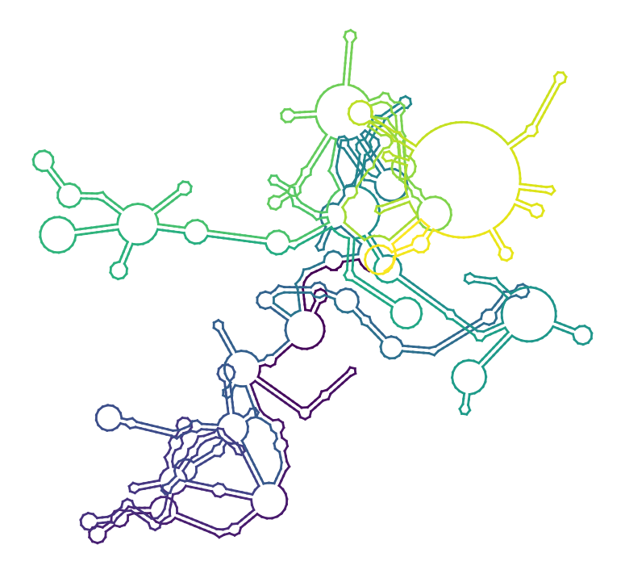</td>
<td>nextPARS</td>
<td>

[Chorostecki et al. 2021](https://doi.org/10.1016/j.csbj.2021.05.045)

</td>
</tr>

<tr>
<td>NORAD#2</td>
<td><em>H. sapiens</em></td>
<td>1,862</td>
<td>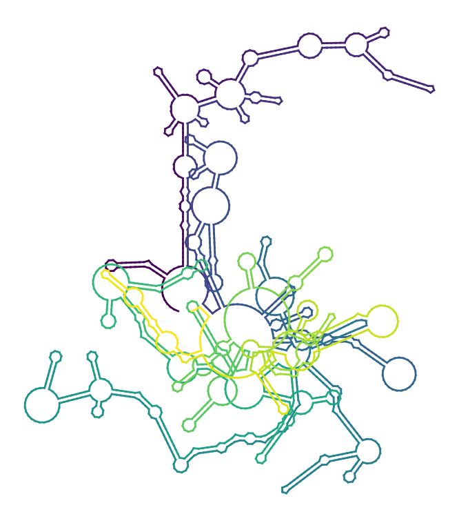</td>
<td>nextPARS</td>
<td>

[Chorostecki et al. 2021](https://doi.org/10.1016/j.csbj.2021.05.045)

</td>
</tr>

<tr>
<td>NORAD#3</td>
<td><em>H. sapiens</em></td>
<td>1,614</td>
<td>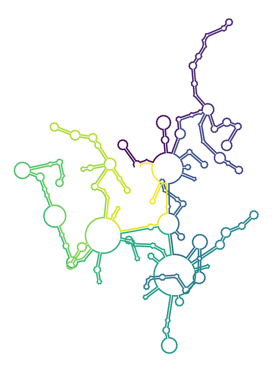</td>
<td>nextPARS</td>
<td>

[Chorostecki et al. 2021](https://doi.org/10.1016/j.csbj.2021.05.045)

</td>
</tr>

<tr>
<td>CYRANO</td>
<td><em>H. sapiens</em></td>
<td>4,419</td>
<td>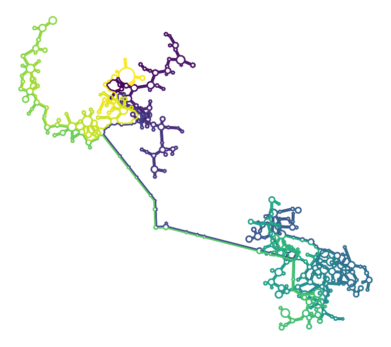</td>
<td>SHAPE</td>
<td>

[Jones et al. 2020](https://doi.org/10.1261/rna.076117.120)

</td>
</tr>

<tr>
<td>MEG3</td>
<td><em>H. sapiens</em></td>
<td>1,595</td>
<td>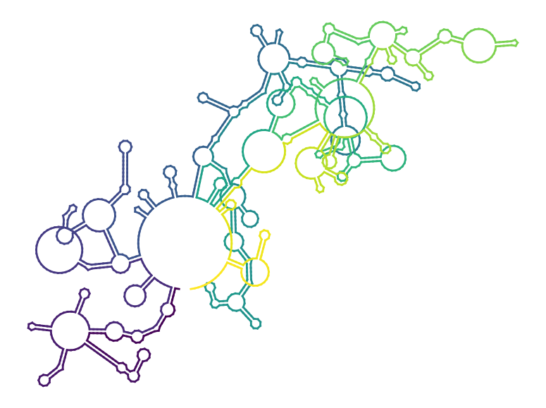</td>
<td>SHAPE</td>
<td>

[Uroda et al. 2019](https://doi.org/10.1016/j.molcel.2019.07.025)

</td>
</tr>

<tr>
<td>RepA</td>
<td><em>M. musculus</em></td>
<td>1,630</td>
<td></td>
<td>SHAPE + chemical probing</td>
<td>

[Liu et al. 2017](https://doi.org/10.1038/nchembio.2272)

</td>
</tr>

<tr>
<td>PAN</td>
<td><em>Human gammaherpes virus 8</em></td>
<td>1,077</td>
<td>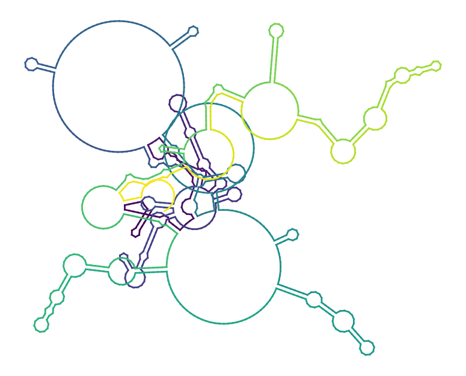</td>
<td>SHAPE + MaP</td>
<td>

[SztubaSolinska et al. 2017](https://doi.org/10.1093/nar/gkx241)

</td>
</tr>

<tr>
<td>XIST</td>
<td><em>M. musculus</em></td>
<td>17,779</td>
<td>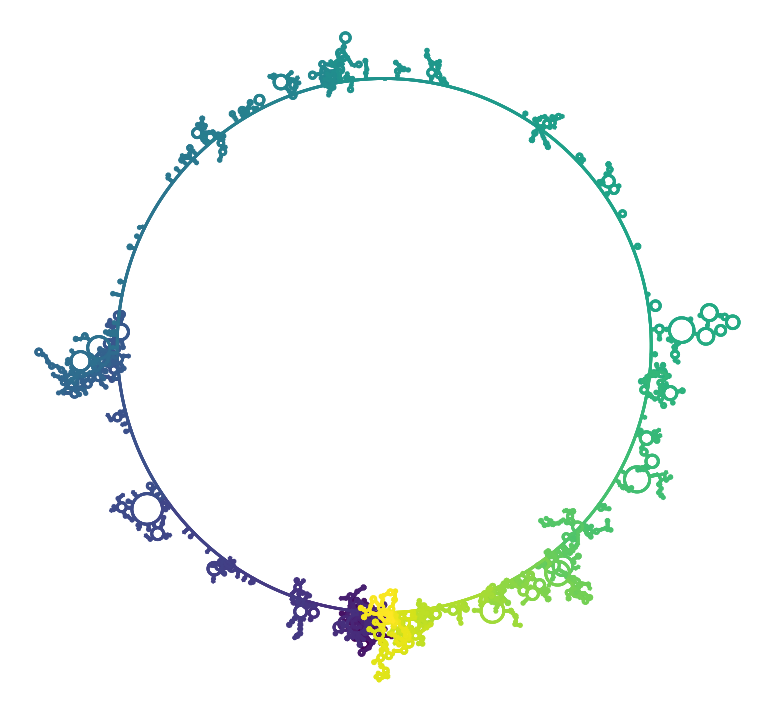</td>
<td>SHAPE + MaP</td>
<td>

[Smola et al. 2016](https://www.pnas.org/content/113/37/10322)

</td>
</tr>

<tr>
<td>lincRNAp21 (sense)</td>
<td><em>H. sapiens</em></td>
<td>311</td>
<td>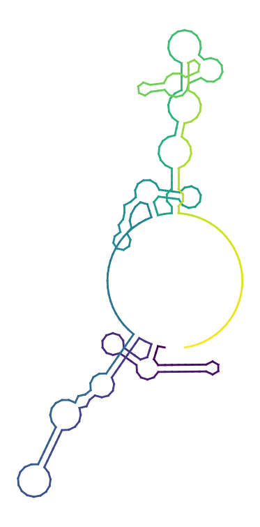</td>
<td>SHAPE</td>
<td>

[Chillón & Pyle 2016](https://doi.org/10.1093/nar/gkw599)

</td>
</tr>

<tr>
<td>lincRNAp21 (antisense)</td>
<td><em>H. sapiens</em></td>
<td>303</td>
<td>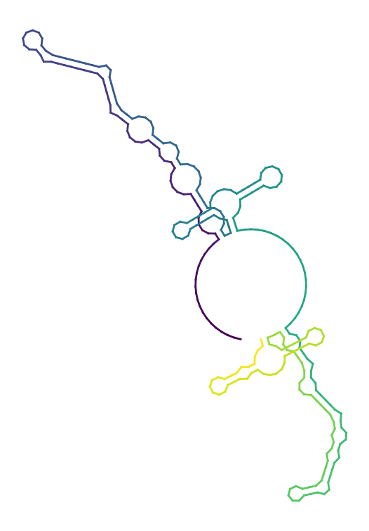</td>
<td>SHAPE</td>
<td>

[Chillón & Pyle 2016](https://doi.org/10.1093/nar/gkw599)

</td>
</tr>

<tr>
<td>HOTAIR</td>
<td><em>H. sapiens</em></td>
<td>2,154</td>
<td>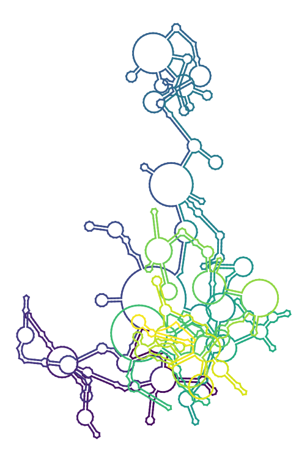</td>
<td>SHAPE + chemical probing</td>
<td>

[Somarowthu et al. 2015](https://doi.org/10.1016/j.molcel.2015.03.006)

</td>
</tr>

<tr>
<td>MALAT1</td>
<td><em>H. sapiens</em></td>
<td>8,415</td>
<td>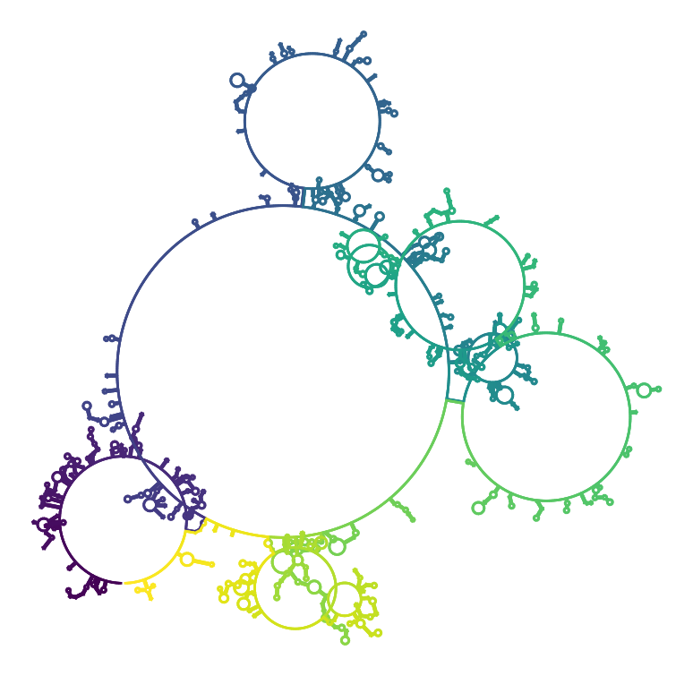</td>
<td>SHAPE</td>
<td>

[Brown et al. 2014](https://doi.org/10.1038/nsmb.2844)

</td>
</tr>

<tr>
<td>ROX2</td>
<td><em>D. melanogaster</em></td>
<td>573</td>
<td>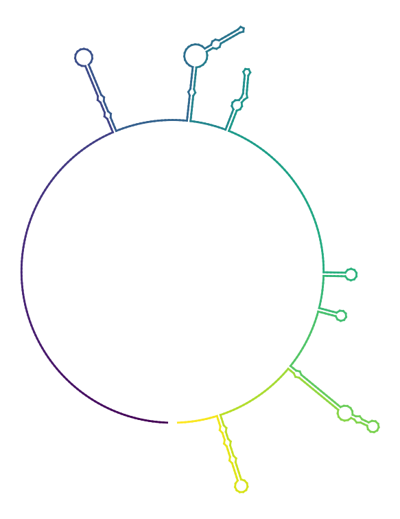</td>
<td>SHAPE + PARS</td>
<td>

[Ilik et al. 2013](https://doi.org/10.1016/j.molcel.2013.07.001)

</td>
</tr>
</table>

## Methods for RNA structure prediction

To facilitate the reproducibility of our experiments, each predictive method evaluated in our study was implemented in a separate Python notebook, which is completely functional and satisfies all the installation requirements. With the exception of SPOT-RNA2, all methods can run in a free Google Collaboratory notebook.

The [methods](methods) folder contains the implementations of each one of the methods in the comparison.

<table>
<tr>
<th>Method</th>
<th>Reference</th>
<th>Year</th>
<th>Type</th>
<th>Repository</th>
<th>Web server</th>
<th>Notebook</th>
</tr>

<tr>
<td>CONTRAFold</td>
<td>

[Do et al.](https://doi.org/10.1093/bioinformatics/btl246)

</td>
<td>2006</td>
<td>Statistical learning</td>
<td>

[Available](http://contra.stanford.edu/contrafold/download.html)

</td>
<td>

[Available](http://contra.stanford.edu/contrafold/server.html)

</td>
<td>

[Link](https://colab.research.google.com/github/sinc-lab/lncRNA-folding/blob/main/methods/CONTRAFold.ipynb)

</td>
<tr>

<tr>
<td>CentroidFold</td>
<td>

[Sato et al.](https://doi.org/10.1093/nar/gkp367)

</td>
<td>2009</td>
<td>Statistical decision theory</td>
<td>

[Available](https://github.com/satoken/centroid-rna-package)

</td>
<td>

[Available](http://rtools.cbrc.jp/centroidfold/)

</td>
<td>

[Link](https://colab.research.google.com/github/sinc-lab/lncRNA-folding/blob/main/methods/CentroidFold.ipynb)

</td>
</tr>

<tr>
<td>ShapeKnots</td>
<td>

[Deigan et al.](https://doi.org/10.1073/pnas.0806929106)

</td>
<td>2010</td>
<td>Dynamic programming</td>
<td>

[Available](http://rna.urmc.rochester.edu/RNAstructure.html)

</td>
<td>

</td>
<td>

[Link](https://colab.research.google.com/github/sinc-lab/lncRNA-folding/blob/main/methods/ShapeKnots.ipynb)

</td>
</tr>

<tr>
<td>ProbKnot</td>
<td>

[Bellaousov & Mathews](https://doi.org/10.1261/rna.2125310)

</td>
<td>2010</td>
<td>Assembling structures from
base-pair probabilities</td>
<td>

[Available](http://rna.urmc.rochester.edu/RNAstructure.html)

</td>
<td>

[Available](https://rna.urmc.rochester.edu/RNAstructureWeb/Servers/ProbKnot/ProbKnot.html)

</td>
<td>

[Link](https://colab.research.google.com/github/sinc-lab/lncRNA-folding/blob/main/methods/ProbKnot.ipynb)

</td>
</tr>

<tr>
<td>RNAstructure</td>
<td>

[Reuter & Mathews](https://doi.org/10.1186/1471-2105-11-129)

</td>
<td>2010</td>
<td>Thermodynamics</td>
<td>

[Available](http://rna.urmc.rochester.edu/RNAstructure.html)

</td>
<td>

[Available](http://rna.urmc.rochester.edu/RNAstructureWeb/)

</td>
<td>

[Link](https://colab.research.google.com/github/sinc-lab/lncRNA-folding/blob/main/methods/RNAstructure.ipynb)

</td>
</tr>

<tr>
<td>RNAfold</td>
<td>

[Lorenz et al.](https://doi.org/10.1186/1748-7188-6-26)

</td>
<td>2011</td>
<td>Dynamic programming</td>
<td>

[Available](https://github.com/ViennaRNA/ViennaRNA)

</td>
<td>

[Available](http://rna.tbi.univie.ac.at/cgi-bin/RNAWebSuite/RNAfold.cgi)

</td>
<td>

[Link](https://colab.research.google.com/github/sinc-lab/lncRNA-folding/blob/main/methods/RNAfold.ipynb)

</td>
</tr>

<tr>
<td>IPknot</td>
<td>

[Sato et al.](https://doi.org/10.1093/bioinformatics/btr215)

</td>
<td>2011</td>
<td>Integer programming</td>
<td>

[Available](https://github.com/satoken/ipknot)

</td>
<td>

[Available](http://rtips.dna.bio.keio.ac.jp/ipknot/)

</td>
<td>

[Link](https://colab.research.google.com/github/sinc-lab/lncRNA-folding/blob/main/methods/IPknot.ipynb)

</td>
</tr>

<tr>
<td>contextFold</td>
<td>

[Zakov et al](https://doi.org/10.1089/cmb.2011.0184)

</td>
<td>2011</td>
<td>Structured-prediction learning</td>
<td>

[Available](https://www.cs.bgu.ac.il/~negevcb/contextfold/ContextFold_1_00.zip)

</td>
<td>

[Available](https://www.cs.bgu.ac.il/~negevcb/contextfold/)

</td>
<td>

[Link](https://colab.research.google.com/github/sinc-lab/lncRNA-folding/blob/main/methods/contextFold.ipynb)

</td>
</tr>

<tr>
<td>RNAshapes</td>
<td>

[Janssen & Giegerich](https://doi.org/10.1093/bioinformatics/btu649)

</td>
<td>2014</td>
<td>Abstract shape analysis</td>
<td>

[Available](http://bibiserv.cebitec.uni-bielefeld.de/rnashapes)

</td>
<td>

[Available](http://bibiserv.cebitec.uni-bielefeld.de/rnashapes?id=rnashapes_view_webservice)

</td>
<td>

[Link](https://colab.research.google.com/github/sinc-lab/lncRNA-folding/blob/main/methods/RNAshapes.ipynb)

</td>
</tr>

<tr>
<td>pKiss</td>
<td>

[Janssen & Giegerich](https://doi.org/10.1093/bioinformatics/btu649)

</td>
<td>2014</td>
<td>Abstract shape analysis</td>
<td>

[Available](http://bibiserv.cebitec.uni-bielefeld.de/pkiss)

</td>
<td>

[Available](http://bibiserv.cebitec.uni-bielefeld.de/pkiss?id=pkiss_view_webservive)

</td>
<td>

[Link](https://colab.research.google.com/github/sinc-lab/lncRNA-folding/blob/main/methods/pKiss.ipynb)

</td>
</tr>

<tr>
<td>SPOT-RNA</td>
<td>

[Singh et al.](https://doi.org/10.1038/s41467-019-13395-9)

</td>
<td>2019</td>
<td>ResNet + biLSTM</td>
<td>

[Available](https://github.com/jaswindersingh2/SPOT-RNA)

</td>
<td>

[Available](https://sparks-lab.org/server/spot-rna/)

</td>
<td>

[Link](https://colab.research.google.com/github/sinc-lab/lncRNA-folding/blob/main/methods/SPOT-RNA.ipynb)

</td>
</tr>

<tr>
<td>LinearFold</td>
<td>

[Huang et al.](https://doi.org/10.1038/s41467-019-13395-9)

</td>
<td>2019</td>
<td>Dynamic programming + statistical learning</td>
<td>

[Available](https://github.com/LinearFold/LinearFold)

</td>
<td>

[Available](http://linearfold.org)

</td>
<td>

[Link](https://colab.research.google.com/github/sinc-lab/lncRNA-folding/blob/main/methods/LinearFold.ipynb)

</td>
</tr>

<tr>
<td>LinearPartition</td>
<td>

[Zhang](https://doi.org/10.1093/bioinformatics/btaa460)

</td>
<td>2020</td>
<td>Dynamic programming + base pairing probabilities</td>
<td>

[Available](http://github.com/LinearFold/LinearPartition)

</td>
<td>

[Available](http://linearfold.org/partition)

</td>
<td>

[Link](https://colab.research.google.com/github/sinc-lab/lncRNA-folding/blob/main/methods/LinearPartition.ipynb)

</td>
</tr>

<tr>
<td>rna-state-inf</td>
<td>

[Willmott et al.](https://doi.org/10.1515/cmb-2020-0002)

</td>
<td>2020</td>
<td>Bi-LSTM</td>
<td>

[Available](https://github.com/dwillmott/rna-state-inf)

</td>
<td>

</td>
<td>

[Link](https://colab.research.google.com/github/sinc-lab/lncRNA-folding/blob/main/methods/rna-state-inf.ipynb)

</td>
</tr>

<tr>
<td>SPOT-RNA2</td>
<td>

[Singh et al.](https://doi.org/10.1093/bioinformatics/btab165)

</td>
<td>2021</td>
<td>Ensemble of deep learning models</td>
<td>

[Available](https://github.com/jaswindersingh2/SPOT-RNA2)

</td>
<td>

[Available](https://sparks-lab.org/server/spot-rna2)

</td>
<td>

</td>
</tr>

<tr>
<td>UFold</td>
<td>

[Fu et al.](https://doi.org/10.1101/2020.08.17.254896)

</td>
<td>2021</td>
<td>U-net</td>
<td>

[Available](https://github.com/uci-cbcl/UFold)

</td>
<td>

[Available](https://ufold.ics.uci.edu)

</td>
<td>

[Link](https://colab.research.google.com/github/sinc-lab/lncRNA-folding/blob/main/methods/UFold.ipynb)

</td>
</tr>

<tr>
<td>MXfold2</td>
<td>

[Sato et al.](https://doi.org/10.1038/s41467-021-21194-4)

</td>
<td>2021</td>
<td>Deep learning + thermodynamic parameters</td>
<td>

[Available](https://github.com/keio-bioinformatics/mxfold2)

</td>
<td>

[Available](http://www.dna.bio.keio.ac.jp/mxfold2/)

</td>
<td>

[Link](https://colab.research.google.com/github/sinc-lab/lncRNA-folding/blob/main/methods/MXfold2.ipynb)

</td>
</tr>

</table>

Each method was used to predict the secondary structure for each sequence in the datasets. Resulting structures are available in the [predictions](predictions) folder.

Finally, the metrics definition, prediction comparisons and figures generation are described in  the [results](results) notebooks:

- [results_sce](https://colab.research.google.com/github/sinc-lab/lncRNA-folding/blob/main/results/results_sce.ipynb): for Saccharomyces cerevisiae dataset.

- [results_lncRNA](https://colab.research.google.com/github/sinc-lab/lncRNA-folding/blob/main/results/results_lncRNA.ipynb): for curated lncRNA dataset.
